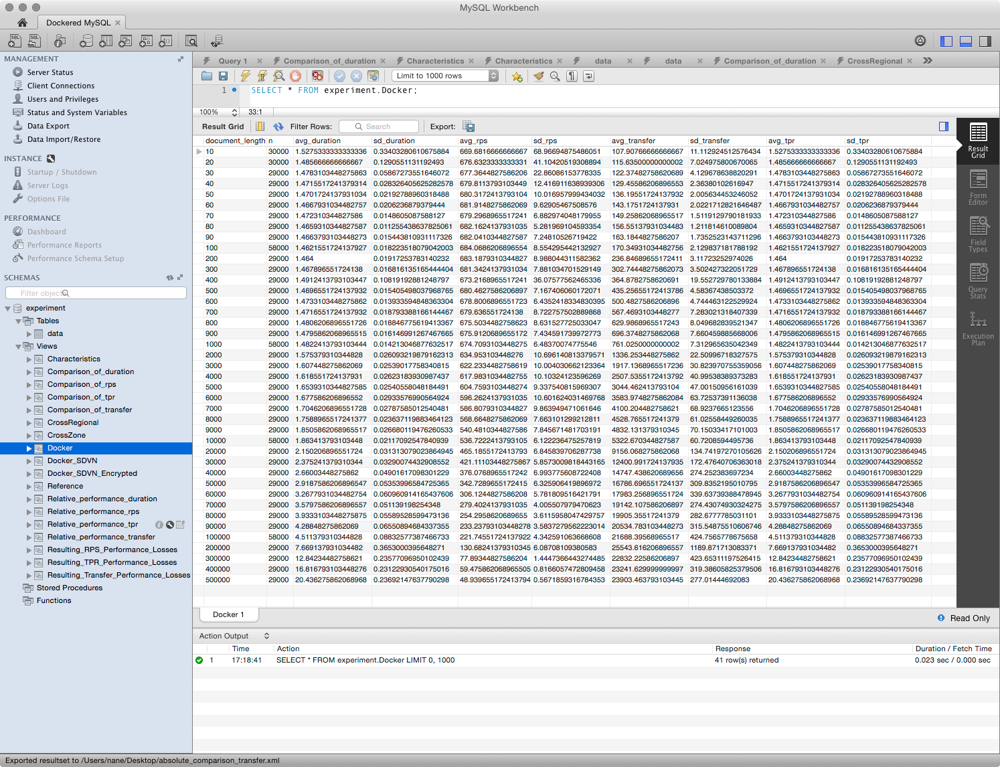

SDVN Impact Database
====================

A Docker container providing a MySQL database containing measurement data and analytical views of several experiments to identify the impact of

- Linux containers,
- Software Defined Virtual Networks (SDVN)
- and Encryption

to the network performance of cloud deployed REST-like services.

Run it by installing Docker and launch the following commands:

```
docker build -t sdvn github.com/nkratzke/sdvn-impact-database
docker run -d -p 3306:3306 sdvn
```

Feel free to access this readonly database with MySQLWorkbench to double check the underlying data.

- __DB:__ experiment
- __DB User:__ reviewer (no password required)




Data has been collected for a conference paper for the [CLOSER 2015](http://closer.scitevents.org/Home.aspx) conference on Cloud Computing and Service Sciences.
